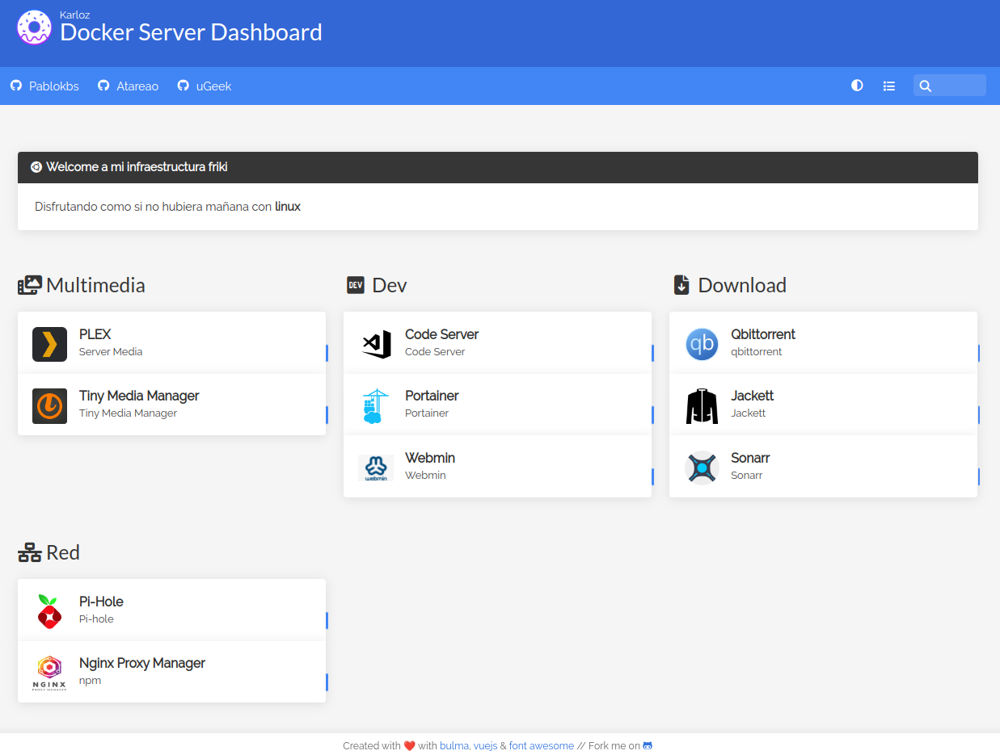

# Mis microservicios

Al conocer la tecnologia de docker e irme intruduciendo poco a poco en todo lo que se puede hacer me di a la tarea de crear mi propio __Self-hosted__

## Servicios desplegados

Cuento con apenas 10 servicios desplegados y aun me falta muchos por desplegar.

### Multimedia
* Plex
* Tiny Meida Manager

### Dev
+ Code Server
+ Portainer
+ Webmin

### Download
* Qbittorrent
* Jacket
* Sonarr

### Red
+ Pi-hole
* Nginx Proxy Manager