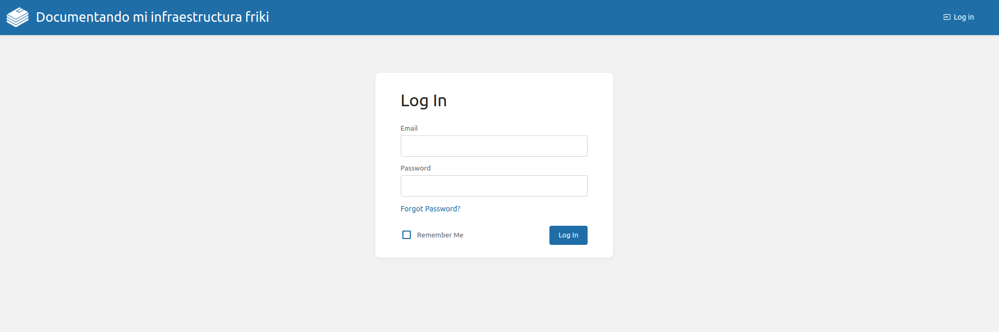

# Bookstack

## Requisitos

- MySQL como gestor de base de datos.
- Imagen de bookstack

## Instalación gestor DB

1. Instalamos el gestor de BD MySQL.

Receta docker compose:
~~~ [yml]
mysql:
  image: mysql
  container_name: mysql
  environment:
    - MYSQL_ROOT_PASSWORD=${PASSSQL}
  volumes:
    - mysqldb:/var/lib/mysql
  networks:
    - database
~~~

Comando de instalación:

~~~ [bash]
dokcer compose up -d mysql
~~~

2. Configuramos usuario, contraseña y permisos.

Accedemos al contenedor:

~~~ [bash]
docker exec -it mysql bash
~~~

Iniciamos sesion con la cuenta **root** en el gestor de BD:

~~~ [sql]
mysql -u root -p
~~~

Creamos usuario y contraseña:

~~~ [sql]
CREATE USER 'bookstack'@'%' IDENTIFIED BY 'contraseña';
~~~

Otorgamos permisos al usuario **bookstack**.

~~~ [sql]
GRANT ALL PRIVILEGES ON bookstack_db.* TO 'bookstack'@'%';
~~~

Salimos del gestor y del contenedor.

## Instalación de bookstack

1. Instalamos bookstack.

Receta docker compose:

~~~ [yml]
  bookstack:
    image: linuxserver/bookstack:latest
    container_name: bookstack
    environment:
      - PUID=1000
      - PGID=1000
      - APP_URL=https://bookstack.com
      - DB_HOST=mysql
      - DB_PORT=3306
      - DB_USER=${DBUBOOKSTACK}
      - DB_PASS=${DBPBOOKSTACK}
      - DB_DATABASE=${DBBOOKSTACK}
    volumes:
      - bookstack:/config
    ports:
      - 6875:80
    restart: unless-stopped
    links:
      - mysql
    depends_on:
      - mysql
    networks:
      - database
~~~

Comando de instalación:

~~~ [bash]
docker compose up -d bookstack && docker compose logs -f bookstack
~~~

2. Accedemos a bookstack desde el navegador colocando la IP del servidor mas el puerto.

Las credenciales para iniciar sesión son `admin@admin.com` como usuario y `password` como contraseña.