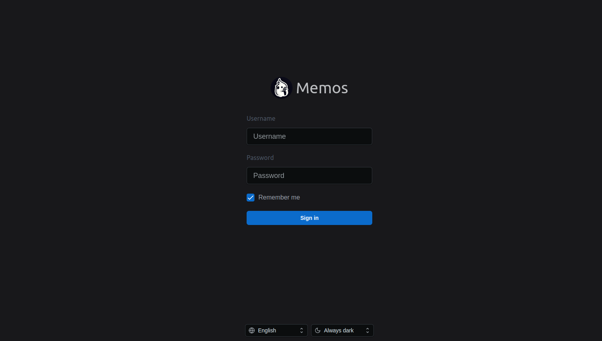

# Memos con mysql en docker

## 1. Crear volumenes y redes

**Realizar esta actividad antes del instalar los servicios.**

~~~bash
docker volumen create mysqldb memos
docker network create database
~~~

~~~yml
volumes:
  mysqldb:
    external: true
  memos:
    external: true

networks:
  database:
    external: true
~~~

## 2. Instalar base de datos mysql

~~~bash
docker compose up -d mysql && docker logs -f mysql
~~~

~~~yml
  mysql:
    image: mysql
    container_name: mysql
    hostname: db
    environment:
      - MYSQL_ROOT_PASSWORD=${PASSSQL}
    volumes:
      - mysqldb:/var/lib/mysql
    networks:
      - database
~~~

## 2. Crear usuario y asignar permisos

Accede al contenedor:

~~~bash
docker exec -it mysql bash
~~~

Iniciamos sesion en mariadb con la cuenta **root**:

~~~bash
mysql -u root -p
~~~

Crear usuario y contraseña:

~~~SQL
CREATE USER 'memos'@'%' IDENTIFIED BY 'contraseña';
~~~

Asociar usuario a la base de datos y brindar todos los permisos.

~~~SQL
GRANT ALL PRIVILEGES ON memos_db.* TO 'memos'@'%';
~~~

Cargamos los privilegios.

~~~SQL
$FLUSH PRIVILEGES;
~~~

## 3. Instalar Memos

~~~bash
docker compose up -d memos && docker compose logs -f memos
~~~

~~~yml
  memos:
    image: neosmemo/memos:stable
    container_name: memos
    volumes:
      - memos:/var/opt/memos
    ports:
      - 5230:5230
    init: true
    environment:
      MEMOS_DRIVER: mysql
      MEMOS_DSN: '${DBUMEMOS}:${DBPMEMOS}@tcp(db)/${DBMEMOS}'
    restart: unless-stopped
    links:
      - mysql
    depends_on:
      - mysql
    networks:
      - database
~~~

Accedemos a Nextcloud desde el navegador colocando la IP del servidor mas el puerto.