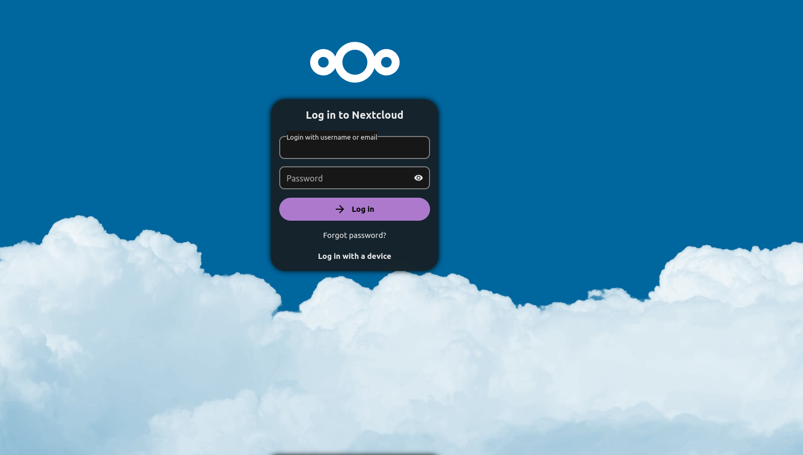

# Nextcloud con mariadb en docker

## 1. Crear volumenes y redes

**Realizar esta actividad antes de instalar los servicios.**

~~~bash
docker volumen create dbmaria cloud
docker network create database
~~~

~~~yml
volumes:
  dbmaria:
    external: true
  cloud:
    external: true

networks:
  databases:
    external: true
~~~

## 2. Instalar base de datos mariadb

~~~bash
docker compose up -d dbmaria && docker logs -f dbmaria
~~~

~~~yml
  dbmaria:
    image: mariadb:latest
    container_name: dbmaria
    hostname: dbmaria
    mem_limit: 2g
    cpu_shares: 768
    init: true
    security_opt:
      - no-new-privileges:true
    ports:
      - 3306:3306
    volumes:
      - dbmaria:/var/lib/mysql:rw
    environment:
      - TZ=${TZ}
      - MYSQL_ROOT_PASSWORD=${SQLROOT}
    restart: unless-stopped
    networks:
      - databases
~~~

## 2. Crear usuario y asignar permisos

Accede al contenedor:

~~~bash
docker exec -it dbmaria bash
~~~

Iniciamos sesion en mariadb con la cuenta **root**:

~~~bash
mariadb -u root -p
~~~

Crear usuario y contraseña:

~~~SQL
CREATE USER 'nextcloud'@'%' IDENTIFIED BY 'contraseña';
~~~

Asociar usuario a la base de datos y brindar todos los permisos.

~~~SQL
GRANT ALL PRIVILEGES ON nextcloud_db.* TO 'nextcloud'@'%';
~~~

Cargamos los privilegios.

~~~SQL
$FLUSH PRIVILEGES;
~~~

## 3. Instalar Nextcloud

~~~bash
docker compose up -d nextcloud && docker compose logs -f nextcloud
~~~

~~~yml
  nextcloud:
    image: nextcloud:latest
    container_name: nextcloud
    hostname: nextcloud
    init: true
    security_opt:
      - no-new-privileges:true
    ports:
      - 80:80
    environment:
      - TZ=${TZ}
      - MYSQL_PASSWORD=${PASSNC}
      - MYSQL_DATABASE=${DBNC}
      - MYSQL_USER=${USERNC}
      - MYSQL_HOST=dbmaria
      - NEXTCLOUD_TRUSTED_DOMAINS=tudominio.com
      - TRUSTED_PROXIES=tudominio.com
      - OVERWRITEHOST=tudominio.com
      - OVERWRITEPROTOCOL=https
    volumes:
      - cloud:/var/www/html:rw
      - ${FILES}:/var/www/html/data
    restart: always
    networks:
      - databases
    links:
      - dbmaria
    depends_on:
      dbmaria:
        condition: service_started
~~~

Accedemos a Nextcloud desde el navegador colocando la IP del servidor mas el puerto.