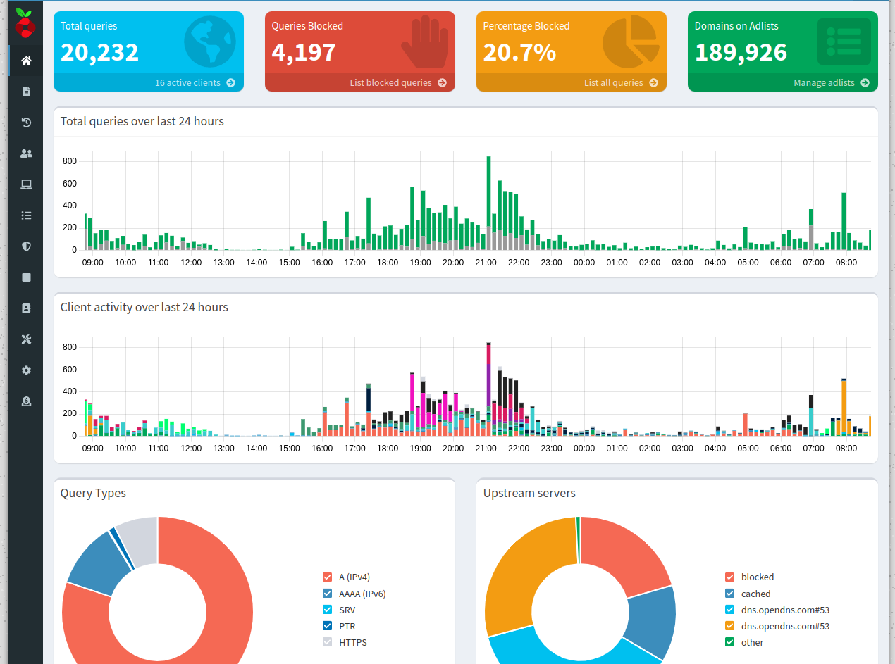

# **Pi-hole**

## Problemas durante el despliegue.

Durante el despliegue del servicio me enfrente con el siguiente error:

Despliegue del contenedor:

`docker-compose up -d pihole && docker logs -f pihole` 

Error:
- - -
~~~
karloz@DockerServer:~/Documentos/compose$ docker-compose start pihole && docker logs -f pihole
Starting pihole ... 
Starting pihole ... error

ERROR: for pihole  Cannot start service pihole: driver failed programming external connectivity on endpoint pihole (baf9198213284cc342cc0ae45f7f301e1ec953b6fd998f625678e994f28bfd31): Error starting userland proxy: listen tcp4 0.0.0.0:53: bind: address already in use
ERROR: No containers to start
ERROR: 1
~~~
- - -

## **Solución 1.**

Investigando en la red di con está solución:

Enliste los servicios que están dados de alta con su correspondiente puerto en el que están escuchando.

`sudo lsof -iTCP -sTCP:LISTEN -P -n +c 10`

---
~~~
karloz@DockerServer:~$ sudo lsof -iTCP -sTCP:LISTEN -P -n +c 10
[sudo] contraseña para karloz: 
COMMAND     PID            USER   FD   TYPE DEVICE SIZE/OFF NODE NAME
systemd-re  597 systemd-resolve   14u  IPv4  23982      0t0  TCP 127.0.0.53:53 (LISTEN)
~~~
---

De está manera identifique que en el puerto 53 estaba trabajando el servicio `systemd-resolved`, procedí a detenerlo y a desactivarlo.

`systemctl stop systemd-resolved`

`systemctl disable systemd-resolved`

---
~~~
karloz@DockerServer:~/Documentos/compose$ sudo systemctl status systemd-resolved
○ systemd-resolved.service - Network Name Resolution
     Loaded: loaded (/lib/systemd/system/systemd-resolved.service; disabled; vendor preset: enabled)
     Active: inactive (dead) since Sun 2023-03-26 12:23:06 CST; 1min 9s ago
       Docs: man:systemd-resolved.service(8)
             man:org.freedesktop.resolve1(5)
             https://www.freedesktop.org/wiki/Software/systemd/writing-network-configuration-managers
             https://www.freedesktop.org/wiki/Software/systemd/writing-resolver-clients
   Main PID: 597 (code=exited, status=0/SUCCESS)
     Status: "Shutting down..."
        CPU: 1.327s
~~~
---

Tras realizar la acción pude desplegar el servicio.

## **SOLUCIÓN ACTUAL.**
Ubuntu tiene una escucha resuelta por systemd en el puerto 53 de forma predeterminada razón por la cual no podemos levantar Pi-Hole.

### **Comprobamos puertos en uso.**
`sudo ss -tulwn | grep LISTEN`  
`sudo lsof -i :53`  

---
~~~
  ┌💁  karloz @ 💻  DockerServer in 📁  Documentos
└❯ sudo ss -tulwn | grep LISTEN
tcp   LISTEN 0      1024                                     127.0.0.1:32401      0.0.0.0:*          
tcp   LISTEN 0      4096                                  100.73.0.118:47956      0.0.0.0:*          
tcp   LISTEN 0      4096                                       0.0.0.0:10000      0.0.0.0:*          
tcp   LISTEN 0      4096                                 127.0.0.53%lo:53         0.0.0.0:* 
~~~
---

---
~~~
┌💁  karloz @ 💻  DockerServer in 📁  Documentos
└❯ sudo lsof -i :53
COMMAND    PID            USER   FD   TYPE DEVICE SIZE/OFF NODE NAME
systemd-r 6808 systemd-resolve   13u  IPv4  52027      0t0  UDP 127.0.0.53:domain 
systemd-r 6808 systemd-resolve   14u  IPv4  52028      0t0  TCP 127.0.0.53:domain (LISTEN)
~~~
---

### **Retirar uso del puerto 53 a systemd-resolved.**

Acedemos a la siguiente ruta para editar el archivo *resolved.conf*

`sudo nano /etc/systemd/resolved.conf`

Descomentamos la siguiente línea y además cambiamos "yes" por "no".

`DNSStubListener=no`

### **Puerto libre.**
Tras reiniciar el equipo podemos comprobar que el puerto está disponible y se puede utilizar.

### **Fuentes.**

+ [stackoverflow - *"cant run pihole in docker-compose"*](https://stackoverflow.com/questions/64402111/cant-run-pihole-in-docker-compose)
+ [discourse.pi-hole - *"Setup on Pi in Docker - Bind Error"*](https://discourse.pi-hole.net/t/setup-on-pi-in-docker-bind-error/19137)
+ [ugeek - *"LIBERAR EL PUERTO 53 UTILIZADO POR SYSTEMD-RESOLVED"*](https://ugeek.github.io/blog/post/2023-01-17-liberar-el-puerto-53-utilizado-por-systemd-resolved.html)
+ [linuxuprising - *"Ubuntu: How To Free Up Port 53, Used By systemd-resolved"*](https://www.linuxuprising.com/2020/07/ubuntu-how-to-free-up-port-53-used-by.html)
+ [esgeeks - *"CÓMO LOCALIZAR Y CERRAR UN PUERTO ABIERTO EN LINUX"*](https://esgeeks.com/abrir-cerrar-puertos-linux/)
