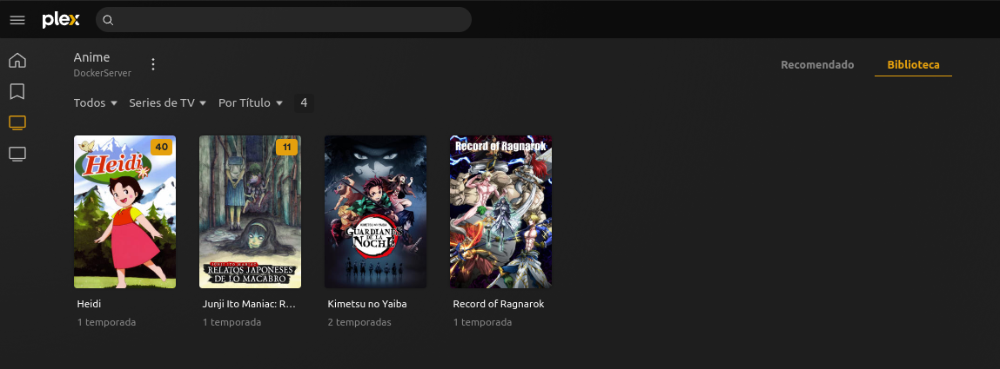

# Multimedia

Utilizo plex como centro multimedia, es una plataforma amigable, llevo casi 5 años empleandola para administrar las series, peliculas y animes.

## Estructura principal

La estrucurea empleada la tome de un canal de Youtube y de la documentacion de plex para tener una adminstración correcta.

---
~~~
┌💁  karloz @ 💻  DockerServer in 📁  Documentos
└❯ tree -Ld 1 media/
media/
├── anime
├── descargas
├── peliculas
└── series

4 directories
~~~
---

## Estructura series y animes - Temporadas

En la organizacion de series y peliculas busco generar una carpeta con el nombre de la serie/anime y complementar con el año de lanzamiento en el interior de esta busco generar subcarpetas con las temporadas.

---
~~~
┌💁  karloz @ 💻  DockerServer in 📁  media
└❯ tree -Ld 2 anime/
anime/
├── Heidi (1974)
│   └── Season 1
├── Junji Ito Maniac Relatos japoneses de lo macabro (2023)
│   └── Season 1
├── Kimetsu No Yaiba
│   ├── Season 2
│   └── Season 3
└── Record of Ragnarok (2021)
    └── Season 2

9 directories
~~~
---
## Estructura serie y animes - Episodios

Para los Episodios buscos darle la estructura SxxExx.

Sxx - Numero de la temporada  
Exx - Numero del episodio

---
~~~
┌💁  karloz @ 💻  DockerServer in 📁  anime
└❯ tree Record\ of\ Ragnarok\ \(2021\)/
Record of Ragnarok (2021)/
└── Season 2
    ├── S02E01.mp4
    ├── S02E02.mp4
    ├── S02E03.mp4
    ├── S02E04.mp4
    ├── S02E05.mp4
    ├── S02E06.mp4
    ├── S02E07.mp4
    ├── S02E08.mp4
    ├── S02E09.mp4
    └── S02E10.mp4

1 directory, 10 files
~~~
---

## **Enlaces de referencia**
+ [NASeros - *"Cómo debemos estructurar, ordenar y renombrar películas y series en Plex"*](https://naseros.com/2015/11/24/como-debemos-estructurar-ordenar-y-renombrar-peliculas-y-series-en-plex/)

